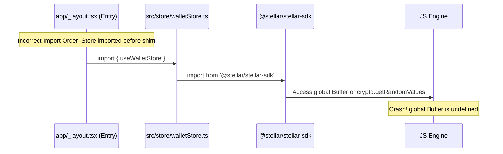

# Stellar SDK Polyfills Guide

This guide explains the required runtime polyfills for `@stellar/stellar-sdk` within the React Native / Expo environment, how they are set up in this project, and why maintaining the strict import ordering is critical.

---

## Why Polyfills Are Required

React Native runs on a JavaScript engine (such as Hermes or JavaScriptCore) rather than Node.js or a standard web browser. Consequently, it lacks many Node.js built-ins and standard Web Cryptography APIs that the `@stellar/stellar-sdk` (and its underlying cryptographic dependencies like `tweetnacl`) rely on. 

Without polyfills, attempting to import or use the Stellar SDK in React Native will result in runtime errors such as:
- `ReferenceError: Can't find variable: Buffer`
- `ReferenceError: Can't find variable: process`
- `crypto.getRandomValues is not a function`
- `Module not found: Can't resolve 'events'`

---

## The Polyfill Configuration

This project resolves these environment limitations using a combination of the `shim.js` setup file and Metro bundler configuration.

### 1. Cryptographic Random Values (`crypto.getRandomValues`)
*   **Why it's needed:** Generating new wallets, keypairs, or cryptographic seeds requires secure random number generation. The browser-standard `crypto.getRandomValues` API is not natively available in React Native.
*   **How it's resolved:** We use `react-native-get-random-values`. When imported, it automatically polyfills the global `crypto.getRandomValues` method using secure native APIs (Keychain/KeyStore equivalents on iOS and Android).
*   **Where it's imported:** At the very top of `shim.js`.

### 2. Node Buffer (`Buffer`)
*   **Why it's needed:** The Stellar network relies heavily on XDR (External Data Representation) binary formats. Signing transactions, parsing keys (e.g., secret keys starting with `S...` or public keys starting with `G...`), and serializing operations require Node's `Buffer` class.
*   **How it's resolved:** We use the npm `buffer` package. In `shim.js`, we expose it globally:
    ```javascript
    import { Buffer } from 'buffer';
    global.Buffer = Buffer;
    ```

### 3. Node Process (`process` and `process.env`)
*   **Why it's needed:** Libraries inside the SDK dependency tree check `process.env.NODE_ENV` or check for the existence of `process` to adapt their execution behaviors.
*   **How it's resolved:** `shim.js` defines `global.process` if it is undefined, and assigns `process.env.NODE_ENV` based on the Expo development environment flags (`__DEV__`).

### 4. Node Events (`events`)
*   **Why it's needed:** Certain parts of the Stellar SDK (such as `EventSource` for streaming ledger/transaction events) depend on the Node.js `events` module.
*   **How it's resolved:** Because Metro cannot resolve Node.js standard modules natively, we install the npm `events` package and map it in [metro.config.js](file:///c:/Users/HP/drips/work/pocketpay-mobile/metro.config.js) under `resolver.extraNodeModules`:
    ```javascript
    config.resolver.extraNodeModules = {
      ...config.resolver.extraNodeModules,
      events: require.resolve('events'),
    };
    ```

---

## Understanding `shim.js`

The [shim.js](file:///c:/Users/HP/drips/work/pocketpay-mobile/shim.js) file consolidates all global-scope polyfills. It must not contain component-level imports or business logic. Its sole purpose is to mutate the global scope to simulate the environment expected by Node-compatible packages.

```javascript
import 'react-native-get-random-values';
import 'text-encoding';
import { Buffer } from 'buffer';

global.Buffer = Buffer;

// Polyfill process for Stellar SDK
if (typeof process === 'undefined') {
  global.process = require('process');
} else { ... }
```

---

## ⚠️ Critical: Import Order

Because JavaScript modules are evaluated when they are imported, the polyfills **must be fully initialized before any module that uses or transitively imports the Stellar SDK is loaded**.

To guarantee this:
1.  **First Line in Root Layout:** In the root entry layout file [app/_layout.tsx](file:///c:/Users/HP/drips/work/pocketpay-mobile/app/_layout.tsx), the very first import statement must be:
    ```typescript
    import '../shim'; // MUST BE FIRST
    ```
2.  **No Imports Above It:** Never place any component imports, store imports, or utility imports above the `shim` import.
3.  **Transitive Imports:** If you import a file (like a Zustand store or validation utility) that imports `@stellar/stellar-sdk` before `shim` has executed, the JS engine will evaluate the Stellar SDK using the un-polyfilled global context, causing the app to crash on launch.

### Example of Polyfill Crash Sequence

